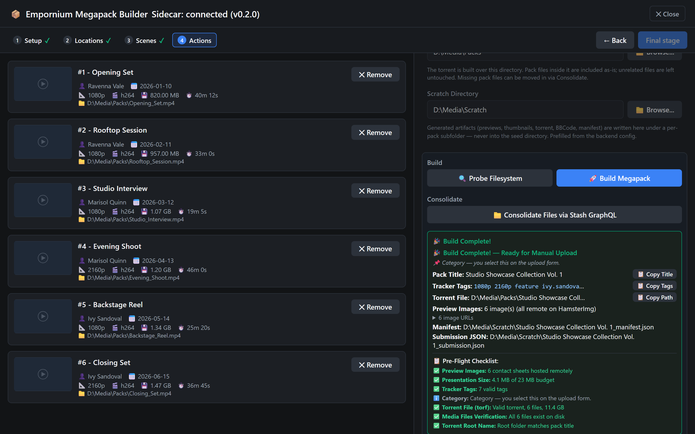
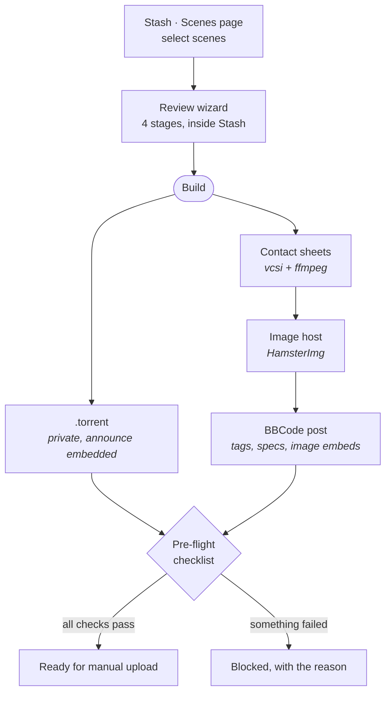
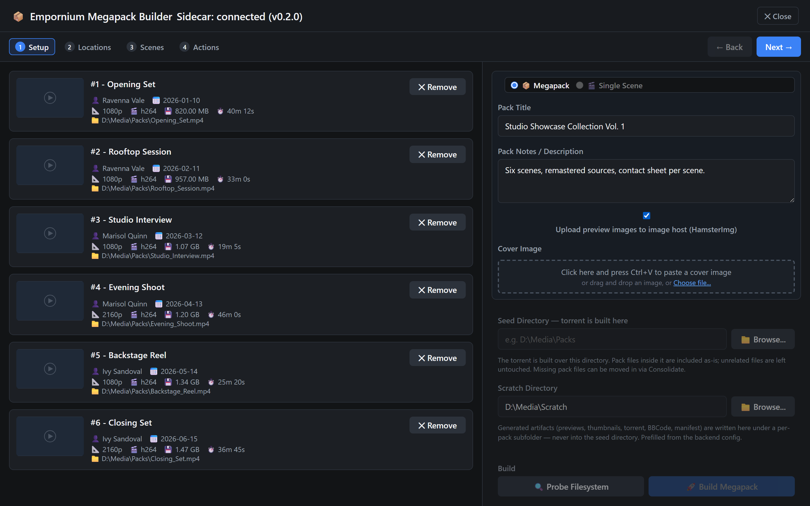
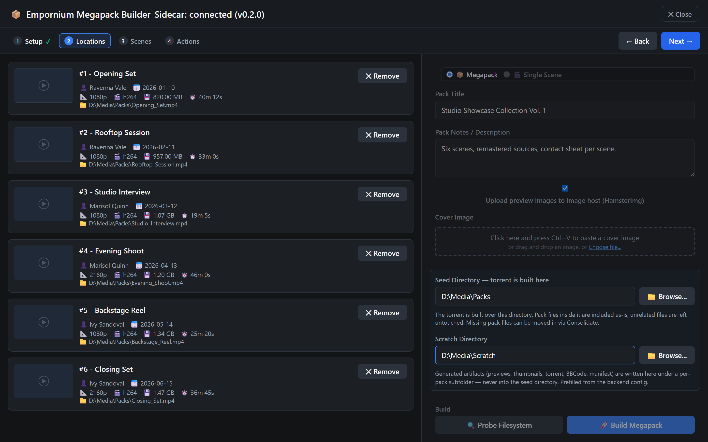
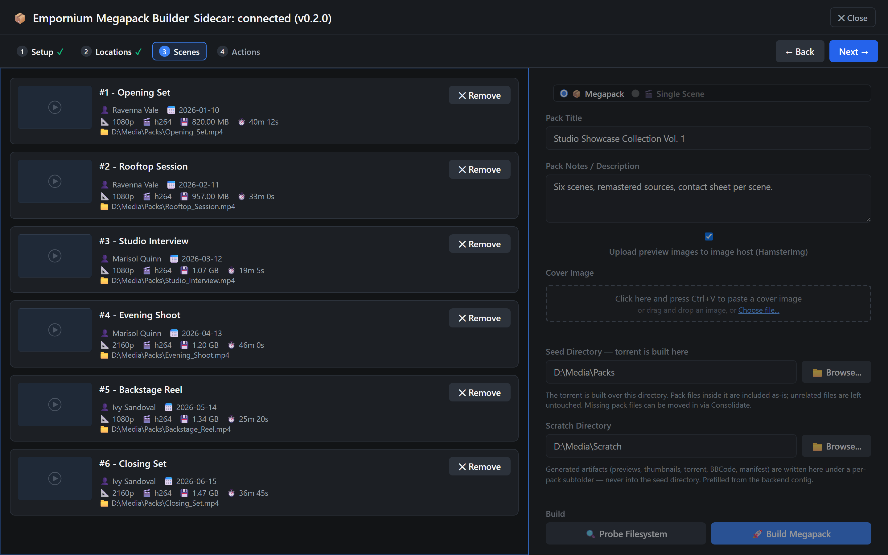
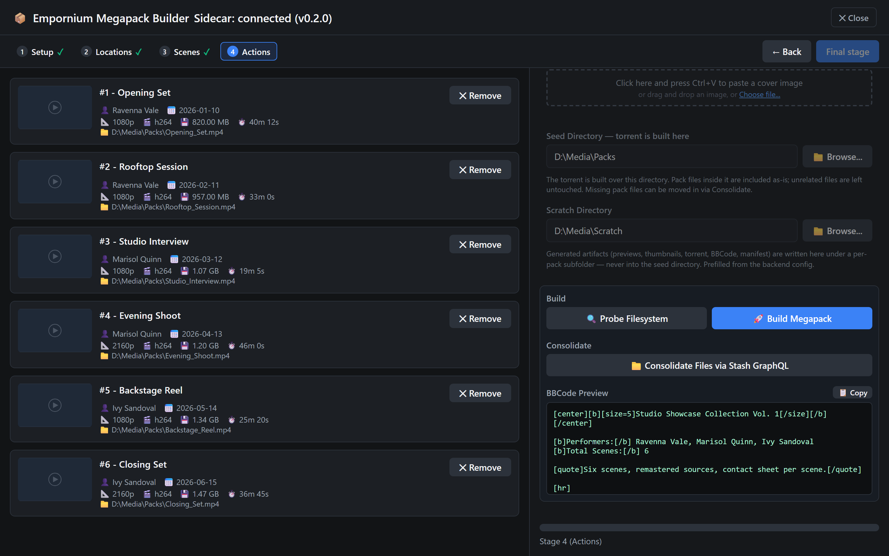

<h1 align="center">Empornium Megapack Builder</h1>

<p align="center">
  <strong>A Stash plugin that turns selected scenes into an upload-ready release.</strong><br>
  Contact sheets, a torrent, and the finished BBCode post — in one pass, without leaving Stash.
</p>

<p align="center">
  <a href="#install"></a>
  <a href="#requirements"></a>
  
  <a href="LICENSE"></a>
</p>

<p align="center">
  
</p>

---

## The problem

Preparing a release by hand is a dozen manual steps across as many tools: generate a
contact sheet for every scene, upload each one somewhere, copy the URLs back, gather
performers and studio and resolution into tags, write the BBCode by hand, make the
torrent, then check you didn't get any of it wrong.

Doing that for one scene is tedious. Doing it for a forty-scene pack is a lost evening,
and a single missed image or a stray `file:///` URL means re-doing the post.

## What this does

You select scenes in Stash and press one button. The plugin walks you through a
four-stage review, then builds everything at once:

- **Contact sheets** — one per scene, generated with `vcsi`/`ffmpeg` and uploaded to
  an image host, with the returned URLs written into the post.
- **A torrent** — private, with your announce URL embedded and the correct `source` tag.
- **The BBCode post** — performers, studio, tags, resolution, duration and every image
  embed, formatted and ready to paste.
- **A pre-flight checklist** — every check must pass before the release is marked ready,
  so you find the problem here rather than on the upload form.

> [!IMPORTANT]
> **This plugin never uploads to the tracker.** It prepares the release and hands you
> the torrent, the title, the tags and the BBCode. You do the upload yourself, on the
> tracker's own form. Nothing is posted on your behalf.

## How it works



### Two release modes

|  | **Megapack** | **Single Scene** |
|---|---|---|
| Scope | Many scenes, one torrent | One scene, one torrent |
| Images | One contact sheet per scene | A full screens grid (10 by default) |
| Consolidation | Can move scattered files into one seed folder | Not needed |

## The four-stage wizard

The wizard opens inside Stash as a bulk action on the Scenes page. Each stage is gated:
**Next** validates what you just did and refuses to advance if something is wrong, so a
build never starts from a bad state.

| | |
|---|---|
| **1 · Setup**<br>Release mode, pack title, notes, and an optional cover image you can paste straight from the clipboard. |  |
| **2 · Locations**<br>The **seed directory** the torrent is built over, and a **scratch directory** for generated artifacts. Both are verified to exist before you can continue. |  |
| **3 · Scenes**<br>Drag to reorder, drop scenes you don't want, and resolve filename collisions. Two scenes with the same filename would overwrite each other, so the stage blocks until you choose. |  |
| **4 · Actions**<br>Probe the filesystem, consolidate files into the seed folder, build, and review the generated BBCode — editable in place — before you copy it. |  |

<sub>Screenshots use placeholder scenes and blank thumbnails — see
<a href="scripts/capture_readme_screenshots.mjs"><code>scripts/capture_readme_screenshots.mjs</code></a>.</sub>

### What you get

When the build finishes, the panel hands you everything the upload form asks for:

- The **`.torrent`**, written next to the seed directory.
- The **pack title** and the **tracker tags**, dot-normalized and deduplicated, each with a copy button.
- The **BBCode**, editable in place, with a size readout against the tracker's post budget.
- A **manifest** and **submission JSON** in the scratch folder, for your own records.
- The **pre-flight checklist**, itemised: preview images, presentation size, tracker tags,
  torrent validity, media file verification, and torrent root name.

If any check fails — most often BBCode still containing local `file:///` URLs because the
image upload didn't happen — the release is marked **not ready** and the copy buttons are
disabled. That is deliberate: it is easier to fix here than to edit a live post.

## Requirements

| | |
|---|---|
| **Stash** | v0.31 or newer |
| **Python** | 3.12+, on the PATH that Stash itself sees |
| **ffmpeg** | Optional but needed for contact sheets. Found via the `ffmpeg_binary` setting, then PATH, then the cove install, then `~/.stash`. `ffprobe` is derived automatically. |
| **vcsi** | Installed for you by the installer — don't install it yourself |
| **An image host account** | A HamsterImg API key, so images are hosted remotely rather than as local paths |

> [!NOTE]
> Stash execs `python` literally. On distributions that ship only `python3`, install
> `python-is-python3` (or add an equivalent symlink) or the task will not start.

> [!WARNING]
> **Always install through the installer script.** `plugin/requirements.txt` is not
> pip-installable on its own: vcsi 7.0.17 pins `pillow==11.2.1` and `numpy==2.2.6`,
> which conflict with `pillow>=12`. `install.ps1` / `install.sh` handle vcsi with
> `--no-deps`; a plain `pip install -r` will fail or produce a broken environment.

## Install

### From within Stash (recommended)

1. In Stash, go to **Settings → Plugins → Add Source** and add:

   ```
   https://barelyboundaries.github.io/empstashuploader/index.yml
   ```

2. Install **Empornium Megapack Builder** from that source.
3. Open the installed plugin folder and run the installer:

   ```bash
   ./install.sh
   ```

   ```powershell
   .\install.ps1
   ```

4. Reload plugins from **Settings → Plugins** (or restart Stash), then hard-refresh
   your browser.

### Manual

Download the release zip, extract it to `~/.stash/plugins/empornium-megapack`, and run
the installer from that folder as above.

The installer verifies your Python version, creates a virtual environment *inside the
plugin folder*, installs the requirements, probes for ffmpeg, and prints what to do
next. It writes nothing outside the plugin folder.

### First run

Add your image host key and announce URL to `config.local.toml` in the plugin folder
(next to `task.py`), then set the seed and scratch directories in stage 2 of the wizard.
See **[Configuration](docs/CONFIGURATION.md)** for the full template.

## The sidecar

A small local FastAPI service, bound to `127.0.0.1:9941`. It is optional for ordinary
builds and **required for consolidation**, and it provides three things:

- **Large selections.** Packs of 66+ scenes are carried through a short-lived token
  instead of the URL, so browser URL limits never truncate your selection.
- **A directory browser.** Pick seed and scratch folders instead of typing paths.
- **Health prefill.** The wizard fills directory fields from the sidecar on open.

Start it with `start_backend.ps1` or `start_backend.sh`. It binds to loopback only and
has no authentication — **never expose it beyond the local machine**.

See **[Sidecar](docs/SIDECAR.md)** for the port policy and its specific error messages.

## Security

- The **announce URL exists only inside the built `.torrent`**. It never appears in the
  UI, the logs, or the BBCode; passkeys are masked in sanitized output.
- Secrets live only in `config.local.toml` (gitignored) or `EMPORNIUM_` environment
  variables. They are never written to committed files.
- The sidecar is loopback-only and unauthenticated. Treat it accordingly.
- Rotate your image host API key periodically.

## Documentation

| | |
|---|---|
| **[Configuration](docs/CONFIGURATION.md)** | Every setting, the full `config.local.toml` template, environment variables, runtime directories |
| **[Sidecar](docs/SIDECAR.md)** | What it does, the fixed port, and its specific failure messages |
| **[Troubleshooting](docs/TROUBLESHOOTING.md)** | Symptom-to-cause table for install and runtime problems |
| **[Development](docs/DEVELOPMENT.md)** | Test suites, GraphQL schema conformance, the `deleteFiles` contract, release process |

## License

[MIT](LICENSE)
